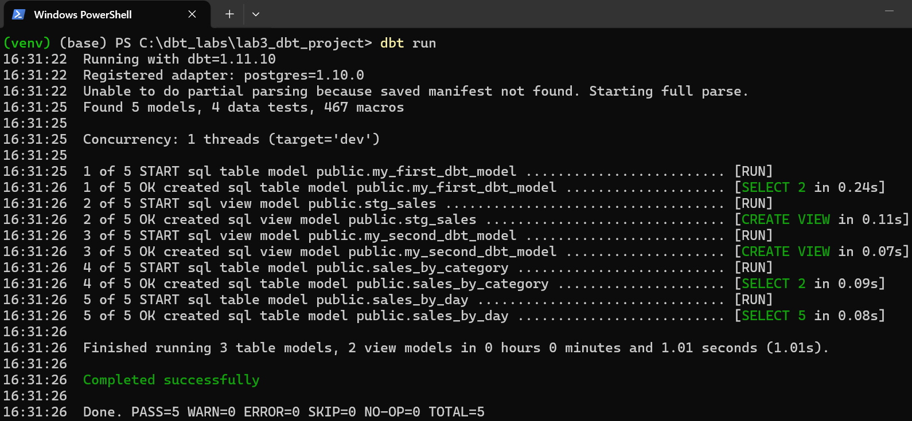
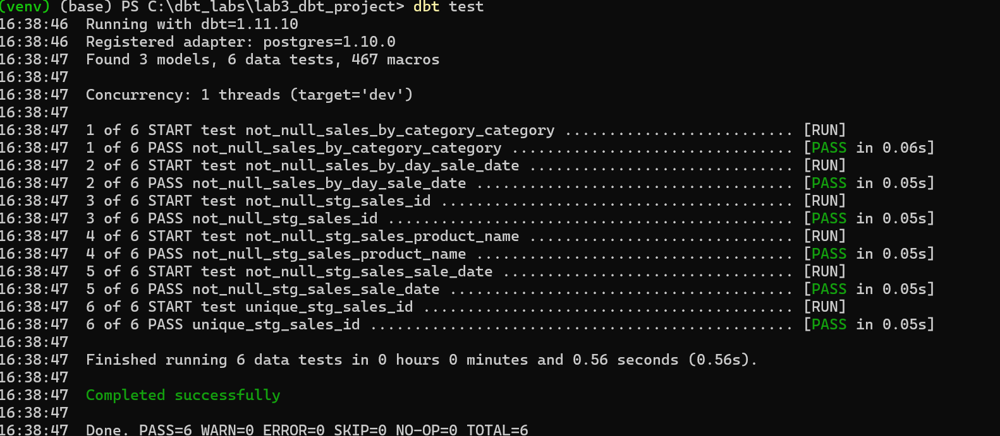
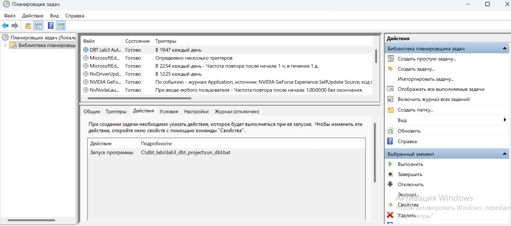
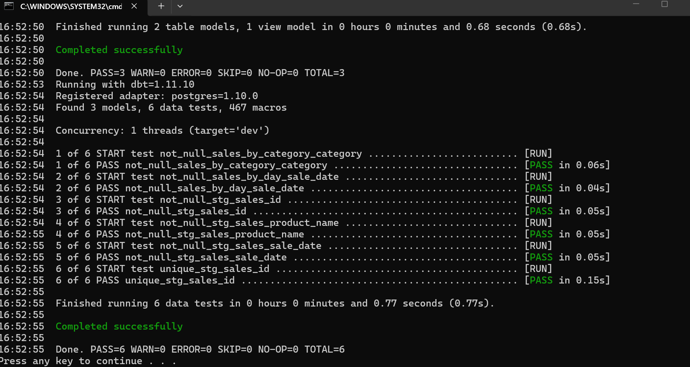

# Лабораторная работа №3: Автоматизированная работа с хранилищами данных с использованием фреймворка Build Data Tools.

## Выполнила: Студент группы ИТБ-О-23/1 Белова Д. А.

## Ход работы

Изначально был установлен dbt Core, создан проект dbt и настроено подключение к базе данных PostgreSQL.

В базе данных была создана исходная таблица `sales`, содержащая данные о продажах товаров. На основе этой таблицы были разработаны модели dbt:

- `stg_sales` — промежуточная модель;
- `sales_by_category` — витрина продаж по категориям;
- `sales_by_day` — витрина продаж по дням.

## Запуск проекта

Для запуска проекта использовалась команда dbt run.

Для запуска тестов использовалась команда dbt test.

Также был создан файл `run_dbt.bat`, который автоматически выполняет команды:

---

## Скриншоты

### Запуск моделей dbt

На скриншоте показано успешное выполнение команды `dbt run`, в результате которого были созданы модели и витрины данных в PostgreSQL.

---

### Запуск тестов dbt

На скриншоте показано успешное выполнение команды `dbt test` для проверки корректности данных и моделей.

---

### Витрина sales\_by\_day

На скриншоте отображается результат выполнения SQL-запроса:

Витрина содержит данные о продажах по дням.

---

### Витрина sales\_by\_category

На скриншоте отображается результат выполнения SQL-запроса:

Витрина содержит данные о продажах по категориям товаров.

### Созданная задача в Планировщике заданий Windows

На скриншоте показана созданная задача `DBT Lab3 Auto Run`, предназначенная для автоматического запуска dbt-проекта по расписанию.

---

### Успешное выполнение задачи в Планировщике

На скриншоте показано успешное выполнение задачи автоматического запуска dbt-проекта.

